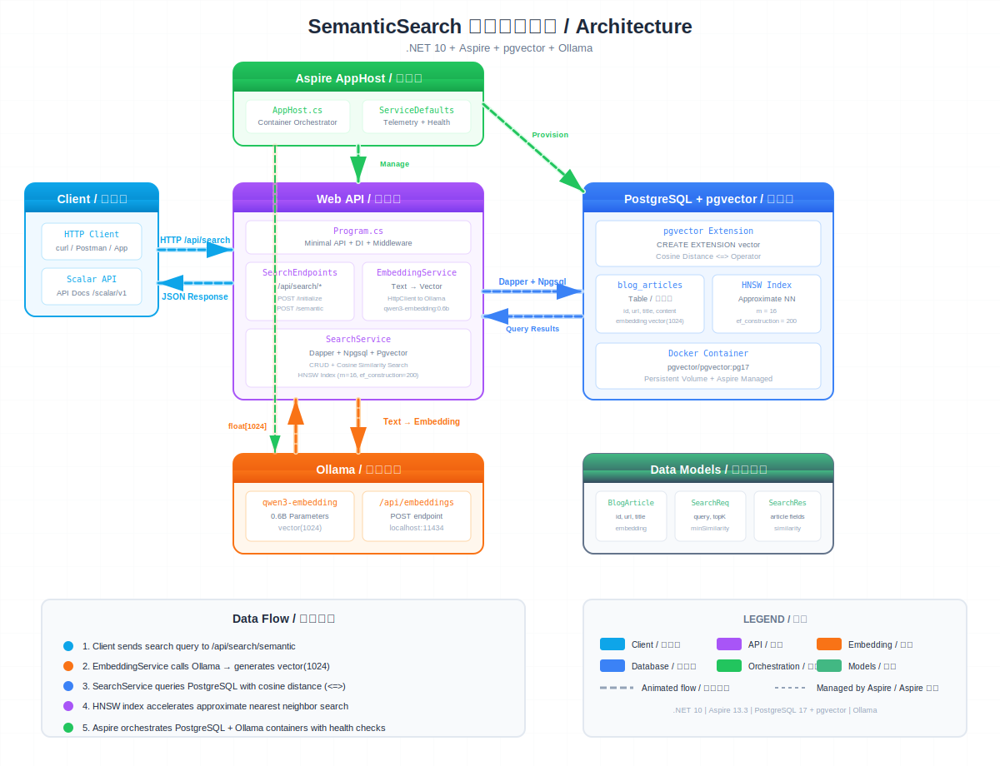

# SemanticSearchDemo / 语义搜索演示

.NET 10 semantic search demo using **pgvector** for vector similarity search and **Ollama** for local embedding generation, orchestrated by **.NET Aspire**.



## Tech Stack / 技术栈

| Component | Technology |
|-----------|------------|
| Runtime | .NET 10 |
| Orchestration | .NET Aspire 13.3 |
| Database | PostgreSQL 17 + pgvector extension |
| Embedding Model | Ollama (qwen3-embedding:0.6b, 1024 dimensions) |
| Data Access | Dapper + Npgsql + Pgvector.Dapper |
| API Style | Minimal API |
| API Docs | Scalar (available at `/scalar/v1` in Development) |

## Module Table / 模块说明

| Module | Project | Responsibility |
|--------|---------|----------------|
| AppHost | `SemanticSearchDemo.AppHost` | Aspire host. Provisions PostgreSQL + Ollama containers, launches API |
| ServiceDefaults | `SemanticSearchDemo.ServiceDefaults` | Shared Aspire config (OpenTelemetry, health checks, service discovery, HTTP resilience) |
| Web API | `SemanticSearchDemo.Api` | Minimal API endpoints, embedding generation, vector similarity search |

## Data Flow / 数据流程

1. Client sends search query to `POST /api/search/semantic`
2. **EmbeddingService** calls Ollama `POST /api/embeddings` to generate `vector(1024)`
3. **SearchService** queries PostgreSQL using cosine distance (`<=>`) with HNSW index
4. Results ranked by similarity score (1 - cosine distance) are returned as JSON

## Quick Start / 快速开始

```bash
# Prerequisites: Ollama running locally with embedding model
ollama pull qwen3-embedding:0.6b

# Run with Aspire orchestration (starts PostgreSQL + Ollama containers + API)
dotnet run --project SemanticSearchDemo.AppHost

# Or run API standalone (requires PostgreSQL already running)
dotnet run --project SemanticSearchDemo.Api

# Build entire solution
dotnet build SemanticSearchDemo.slnx
```

## API Endpoints

All endpoints are under `/api/search`.

| Method | Route | Description |
|--------|-------|-------------|
| `POST` | `/initialize` | Create table, enable pgvector extension, build HNSW index |
| `POST` | `/articles` | Insert single article with auto-generated embedding (upsert by URL) |
| `POST` | `/articles/batch` | Batch insert articles (max 100) |
| `GET` | `/articles` | List all articles |
| `POST` | `/semantic` | Semantic search |
| `GET` | `/quick?q=...&k=...` | Quick semantic search via query params |

## Example Requests

### Initialize Database

```bash
curl -X POST http://localhost:5006/api/search/initialize
```

### Insert Article

```bash
curl -X POST http://localhost:5006/api/search/articles \
  -H "Content-Type: application/json" \
  -d '{
    "url": "https://example.com/intro-to-vectors",
    "title": "Introduction to Vector Search",
    "content": "Vector search uses embeddings to find semantically similar documents..."
  }'
```

### Semantic Search

```bash
curl -X POST http://localhost:5006/api/search/semantic \
  -H "Content-Type: application/json" \
  -d '{
    "query": "how does vector search work",
    "topK": 5,
    "minSimilarity": 0.5
  }'
```

### Quick Search

```bash
curl "http://localhost:5006/api/search/quick?q=vector+search&k=3"
```
